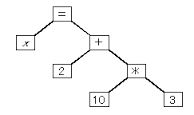

# Equation-Trasformation-in-Haskell

#_Basic Idea_

* Arithmetic formula can be desctibed in tree representation whose top node is equal sign, the rest of node is operator and leaf (edge) is number or variable.

* Insertion, deletion, rotation of branches can be basic operation of operating equation.

* Principle of its implementation
1. Being faithful to step by step expansion which has no leap like human's cognition do

####So far
only for equation containing addition and subtraction which has just one variable

##Process

1. String input (Polish Notation)
2. List of Haskell Data type
3. Division of left side of to equal sign and right side of it
4. Making a Tree
5. calculation by pattern matching 
* removing branch -> simple calculation
6. finally : inseting branch -> transposition

##Operation Details (when it contains variable on either leaf)
#### from priority higher to lower
1. inversion :: (subtraction -> addition)
2. commutativity (addition,multiplication) -> branch exchange, rotation
3. associativity (addition,multiplication) -> rotation
4. distribution  (clause which has multiplication & addition) -> rotation & insertion

note 
* I am a Haskell beginner -> No monad, a lot of ()
* suppose to have web interface.
* Day by Day Updated